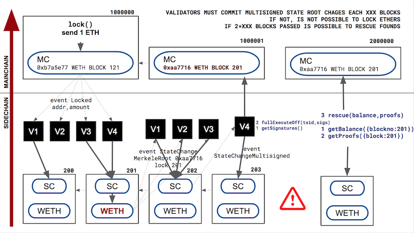

# gometh experimental sidechain PoC

## TL;DR

Gometh is a double-peg sidechain that mainly:

- Deploys two contracts, one in the mainchain called `GomethMain` and another in the sidechain named `GomethSide`
- Anybody can send ethers from the mainchain to the side chain by calling the `lock()` method in the `GomethMain`, this will:
  - keep the sent ethers in the main chain (diposit)
  - generates a wrapped ether `WETH` in the sidechain
- This sidechain wrapped ether can be converted to sidechain local ether to execute smartcontracts, but them cannot be converted back to WETH. This converted `WETH` will go to the maintainers of the sidechain nodes.
- `WETH`s can also converted back to mainchain ethers by calling the `burn()` function in the `GomethSide`. In this case, a voucher is generated. This voucher can used in the `GomethMain` contract to recieve the mainchain ethers.
- `WETH` also contains a patricia tree (https://github.com/chriseth/patricia-trie), and validators should commit their state root to the main net. There's a rescue procedure in the case there's validators stop working.

got a lot of inspiration of https://github.com/paritytech/parity-bridge

## Disclaimer

TOY PROJECT, FOR FUN & LEARN. DO NOT USE IN PRODUCTION.

## Tasks

- [x] Initial contracts
- [x] Minimal golang server to handle it (https://github.com/adriamb/gometh-server)
- [x] Docker configuration to test it
- [ ] Complete set of tests 
- [ ] Prepare for real use cases
  - [ ] Golang async handling of transactions/receipts
  - [ ] Kafka (?) for safe handling events/transactions
  - [ ] Multisig support for “alias address” to send concurrent transactions with different addresses
- [ ] Improve?
 - [ ] Better alternatives for global settlement. Check plasma cash way. WETH balances has also tx count, is possible to proof that lock() operation is not done when committing the WETH root when using signed state root & merkle proofs?
 - [ ] Automatic update PoA authorities on events ( geth clique )
 - [ ] Validators stakes some amount, if global settlement is done, stake is burnt
 

## More detailed info

### Mainchain -> sidechain 

When sending ethers from main to side chain

- User calls the method `lock()` with the amount of ethers he wants to send to the side chain, and a Locked event is generated
- Validators are listening to this event, and each one executes a `partialExecuteOf()`, that is a multisig call for  `_mintmultisigned()`
- When 2/3 of validators called the `partialExecuteOf()` , the `_mintmultisigned()` is then executed, this will:
  - Generate `WETH` for the user
  - Generate small amount of local ethers to start using the sidechain
  - Generate a `LogMintMultisigned` call

### Sidechain -> mainchain 

To bring back the ethers to the mainchainchain

- User calls `burn()` in the sidechain
 - the wrapper ethers are burnt
 - generates a Burn() event
- Validators captures the event and generates an offline multisignature to `_burnmultisigned()`
 - when 2/3 of validators executed this function an BurnMultisigned event is generated. This means that the voucher is available
- The user needs to retrieve all this generated signatures with `getSignatures()`, and then execute this multisig transaction on the main chain using `fullExecuteOff()` sending the parameters of the call and the collection of all generated sidechain signatures.
  - this will call on the mainchain the `_burnmultisigned` that will unlock the ethers to the user

  
  
### Changing the set of sidechain signers

Allows sidechain signers to be added/removed, since sidechain acts as a multisig. All signer changes in the sidechain, could be applied in the mainchain in one only transaction

- Validators sends an offline multisig call for `_changesignersmultisigned` with the new set of validators.
- When 2/3 of the validators are called the `_changesignersmultisigned` adds a new set of signers, a new EPOCH is generated with the set of signers
- In the same way that the voucher is executed, transaction signatures can be collected with `getSignatures()` and then `_changesignersmultisigned` is executed in the main chain using `fullExecuteOff()`.
- Both mainchain and sidechain now have the same set of signers EPOCHs

### Global settlement

In order to provide a way to solve the problem when validators stops working:

- Each time WETH is modified, the event `StateChage` specifying that the state root of the WETH has been changed is lauched.
- This event is captured by validators, and generates the offline multisignature `_statechangemultisigned`. When 2/3 of validators signed it, it generates a `StateChangeMultisiged` event.
-  In the same way that the voucher is executed, transaction signatures can be collected with `getSignatures()` and then `_statechangemultisigned` is executed in the main chain using `fullExecuteOff()`.
- If the `_statechangemultisigned` is not executed in the mainchain in 40000 blocks, something is going wrong, so ethers cannot be locked in the main chain
- If the `_statechangemultisigned` is not executed in the main chain in 80000 blocks, the sidechain is no longer usable. Users can still unlock their amount:
  - Retrieve the last valid WETH state root block stored in the main chain
  - Go to a full archive sidechain node and in the WETH contract
    - Get the balance at this block for the account
    - Retrieve the patricia branches this block using `getProofs()`
  - Execute the `refund()` function in the main chain that verifies the proof and returns the amount to the user
  

  
